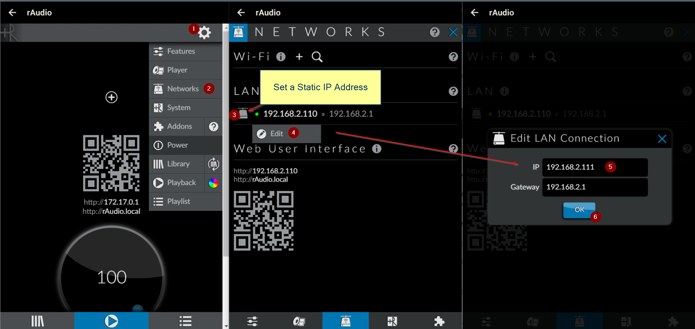

# LMSrAudio [IMG] 64-bit for Pi 3 & Pi 4
You have an affinity for LMS, enjoy the Material Skin interface, and are particularly accustomed to using LMS/Material Skin on mobile devices. However, there are times when you reminisce about the alluring audio experience provided by Archphile or Rune Audio on the Arch Linux platform from many years ago. You can now rekindle that experience with the return of rAudio (Arch Linux).

I have personally created a customized build based on [LMS](https://github.com/Logitech/slimserver), [Material Skin](https://github.com/CDrummond/lms-material), and Squeezelite build-on for [rAudio](https://github.com/rern/rAudio) to meet my own needs and those of my friends. rAudio, as I understand, is a different branch of Rune Audio.

I've added some features to make it user-friendly for regular users. I want to share it with anyone who wants to use it.

What's special about this build is that it can play YouTube videos on the TV screen and deliver high-quality audio through the DAC. Sometimes, even when I turn off the TV, the Pi 4 DAC continues playing music from YouTube. Importantly, you can use the YouTube app on a mobile device to search and control the Pi 4 playback. I've also included the Tidal Connect Docker from the [GitHub repository](https://github.com/GioF71/tidal-connect) for use with the Tidal app. When you switch the SQ64-rAudio player to off, Tidal Connect will appear.

I did this out of a passion for sound and to enhance user-friendly interaction for audio enthusiasts.

You can use software like Win32 Disk Imager or BalenaEtcher to flash the LMS rAudio OS images to SD cards.

Access the Music Server DAC interface by navigating to http://raudio/ or http://raudio.local/ in your browser. In case you cannot locate it, use the Advanced IP Scanner software to discover the IP address of rAudio. Subsequently, access it via the IP address; for instance: http://192.168.0.2.

In the Material Skin interface, click on the Configuration menu, scroll down to the bottom of the page to update to the LMSrAudio latest version.

>
For the first run, sometimes with certain routers, you might encounter an empty Configuration menu. Access the Configuration menu at http://192.168.x.x/config. Update to version 4.9.28 to resolve the menu link issues.

>
>
**Download** [LMSrAudio IMG file URL here]:
https://drive.google.com/file/d/1pi3Vy_He6vUO_rfeEYwZQY5uG4Nb1pwS/
>
>
>
--------------------
**Download new version 06/2025** [Lyrion LT (Real-time kernel)]:
https://drive.google.com/file/d/1A4NiBbrvodBdte03iI4rI5WCjTnXa7vF/

>
The Lyrion LT (Real-time kernel) version 06/2025 base on Lyrion 9.1 https://lyrion.org/
>
Support Pi 4 and Pi 5
>
>
>
>

>
>

>
>

>

>

>

---------------------
>
SSH credentials: user 'root,' password 'ros.' You can customize these credentials and have full permissions to modify the source code according to your specific requirements.

>
>

---------------

>
- LMSBubv9 Server: Play music from your BubbleUPnP Server (NAS...).
- Parametric EQfa12: Adjust EQ parameters for your headphones or audio system.
- Configuration: DAC; Server; EQ; Output; LCD...
- Mount USB-NTFS: Automatically fix and mount NTFS-formatted hard drives that rAudio doesn't recognize.
- Scan Library: Set up your music library with LMS.
- rAudio: Open the rAudio interface, where you can configure Wi-Fi, LAN, add NAS, and more.
>
----------------

>
Configuration menu:
- Choose between I2S DAC or USB DAC.
- Select music playback from LMS or Roon Server.
- Choose output for Squeezelite.
- Log in to your BubbleUPnP Server.
- Opt for displaying either YouTube Video or LMS UI on the LCD/TV, especially searching and controlling via the YouTube app on your mobile device. 
- Switch display between 2 HDMI screens.
>

------------
>
### App Control
Use the app Rune Audio, app [rAudio](https://play.google.com/store/apps/details?id=com.raudio&hl=en&gl=US) or you can use the app for Android: [Fully Kiosk Browser & Lockdown](https://play.google.com/store/apps/details?id=de.ozerov.fully&hl=en), and the app for iOS: [Kiosker: Fullscreen Web Kiosk](https://apps.apple.com/us/app/kiosker-fullscreen-web-kiosk/id1481691530).
>
>

>
----------------
### Play from USB Disk

>
--------
### Play with BubbleUPnP Server
>
After logging into the BubbleUPnP Server from the Config menu. Access to the LMSBubv9 Server menu. Opt for the Server, select the Folder view option, pick the music album you wish to listen to and click "Add Album" to play it in your LMS.
>

>
----------
>
### Parametric EQ (12 band)
>
The [Parametric EQ 12-band9](https://github.com/lovehifi/eqfa12) is a powerful tool for adjusting and optimizing audio with precise control over different frequency ranges. Ideal for fine-tuning your sound experience, it allows users to customize specific aspects of the audio output with simplicity and accuracy.
>

>

User Note: You need to select the "Eqfa12p" output from the Config menu for Squeezelite to use. You can switch between Squeezelite outputs to compare sound changes instantly without restarting the Pi.
>
--------
### Play with Tidal Connect

>

**If you encounter a situation where Tidal Connect is connected but there is no sound?**
>
If you experience issues connecting to Tidal Connect, it may be related to DNS configuration. To resolve this, update to the latest version and modify the DNS settings for Tidal Connect. Replace the string '8.8.8.8 8.8.4.4' with the IP address of your router in the Configuration menu.

>

------------
>
### Play Youtube Video
>

Note:
Youtube on LCD has been turned on for the first time.
- On LCD or TV, tap the settings icon at the bottom.
- Tap 'Link with TV Code' to display the code.
- Next, in the YouTube app on your phone, select the Cast icon, then 'Link with TV code.
- Switch the **SQ64-rAudio player to off** before you play a YouTube video.
- Once completed, you can choose to cast to the TV (Youtube on LCD).
>

Video clip by a user using a phone to **cast YouTube video** from their phone to the Pi 4, displaying the video on the TV via HDMI and the audio to the Pi 4 DAC.
https://youtu.be/cwVGm7qOUq8
>
**You are not using YouTube Video or displaying the LMS on screen, turn off the LCD (button Clear cache browser Turn off LCD), this will save a lot of CPU processing.**
>
------------
>
### HDMI Config
hdmi_group=1 and hdmi_group=2 are two different HDMI mode groups, and they define different standards and configurations for HDMI output. Here is the difference between them:

**HDMI Group 1 (CEA - Consumer Electronics Association):**

- Intended for consumer devices such as TVs, projectors, etc.
- Supports a variety of resolutions and refresh rates common in the consumer electronics industry.

**HDMI Group 2 (DMT - Display Monitor Timings):**

- Intended for computer monitors and computer display devices.
- Supports resolutions and refresh rates suitable for computer monitors.
When you use hdmi_group=1, you are selecting configurations that are more common in the consumer electronics industry. On the other hand, hdmi_group=2 is the choice for computer monitors and computer display devices.

If you are using a TV, typically you would choose hdmi_group=1. If you are connecting Raspberry Pi to a computer monitor, then you might choose hdmi_group=2. Depending on the specific device and use case, you can select the group that is more suitable for your needs
>
>
You can make adjustments to the HDMI configuration in the /boot/config.txt file.

>
Config HDMI port 1 for 65 inch (HDMI port 1):
>
> hdmi_drive=2
>
> hdmi_force_hotplug=1
>
> hdmi_force_mode=1
>
> hdmi_group=1
>
> hdmi_mode=4
>
--------------------
>
### How to change the root password in LMSrAudio?
>
Open Putty (Windows) or Terminal (MAC OS). Login to SSH as root with the password "ros".
>
> ssh root@raudio
>
or
>
> ssh root@raudio.local
>
or
>
> ssh root@your_pi_ip
>
(replace "your_pi_ip" with the actual IP address of your Raspberry Pi).
>
> sudo passwd
>
Enter the new password and press Enter.
>
-------------
>
### Set a Static IP Address
>

>

-----------------
## USB Wifi rAudio-compatible
>
Comfast CF-951AX (mt7921au chipset).
>
TP-Link WN822N V3 (rtl8192eu chipset).
>

------------------

-----------------
## Flash LMSrAudio to Pi 5
>

>

------------------
### Why rAudio-LMS ?
>
https://github.com/lovehifi/raudiolms-32bit/wiki/Why-rAudio%E2%80%90LMS%3F
>

